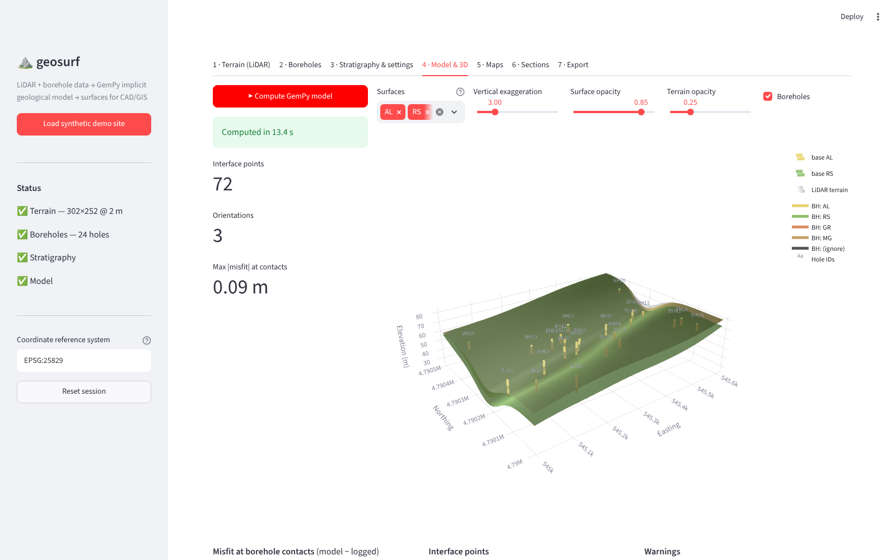

# geosurf

**LiDAR + borehole / geotechnical data → [GemPy](https://github.com/gempy-project/gempy) implicit geological model → geological surfaces for CAD and GIS.**

geosurf wraps GemPy (v2025+/2026, `gempy_engine` backend) in a Streamlit interface and a scriptable pipeline that:

1. builds a **DTM from a LiDAR point cloud** (LAS/LAZ, ground class filtering, gap filling) or loads a GeoTIFF DEM;
2. loads **boreholes** from CSV/Excel (collars + intervals + survey, or a single flat table) and **AGS4**, with automatic column detection, desurveying of inclined holes and log QA;
3. **drapes collars on the LiDAR** (fills missing elevations, flags surveyed vs LiDAR differences);
4. maps lithology codes to model units and builds the stratigraphic column;
5. converts logs to GemPy **interface points + orientations**, runs the implicit interpolation with the LiDAR as topography;
6. extracts per-contact **surfaces**, applies erosion/stacking and clips them to the terrain;
7. produces **thickness (isopach) and depth maps, volumes, cross-sections** and a **3D viewer**;
8. exports **GeoTIFF / Esri ASCII / XYZ**, **DXF** (3DFACE TIN, contours, borehole traces, 3D section lines), **OBJ** and **VTK**;
9. saves a **`project.json`** so the same setup can be re-run unattended when new data arrive.

```
LAS/LAZ ─► DTM ─┐                                   ┌─► GeoTIFF / ASC / XYZ grids
GeoTIFF ────────┤                                   ├─► DXF TIN + contours + boreholes
CSV/XLSX ─┐     ├─► contacts + orientations ─► GemPy ├─► OBJ / VTK meshes
AGS4 ─────┴─► boreholes (desurvey, drape, QA) ─┘     ├─► isopach / depth / volumes
                                                    └─► cross-sections, 3D viewer
```



## Quick start

```bash
pip install -r requirements.txt
streamlit run app/streamlit_app.py          # then "Load synthetic demo site" in the sidebar
```

Command line / automation:

```bash
python -m geosurf.cli demo examples/synthetic_site            # synthetic LiDAR + boreholes + project.json
python -m geosurf.cli run  examples/synthetic_site/project.json  # full model + exports -> output/
python -m geosurf.cli dtm  survey.laz dtm_1m.tif --cell 1 --stat min
pip install -r requirements-dev.txt && python -m pytest -q tests   # 20 tests, ~30 s
```

Python API:

```python
import geosurf as gs
from geosurf.outputs import export_all

dtm = gs.las_to_dtm("lidar.laz", cell=1.0, crs="EPSG:25829")
bs  = gs.BoreholeSet.from_tables(collars_df, lith_df, survey_df).merge(gs.load_ags4("si.ags"))
bs.drape(dtm, mode="missing")
bs.intervals["unit"] = bs.intervals["lith"].map({"CL": "AL", "SA": "AL", "RS": "RS", "GR": "GR", "MG": "MG"})
strat = gs.Stratigraphy.from_list(["MG", "AL", "RS", "GR"])           # top -> bottom, last = basement
res = gs.run_pipeline(bs, strat, dtm, gs.ModelConfig(resolution=(60, 60, 80)))
export_all(res, "output", sections={"A": [[x1, y1], [x2, y2]]}, boreholes=bs)
```

## Deploy on Streamlit Community Cloud

1. Push this repository to GitHub (e.g. `bernardo-glitch-es/geosurf`).
2. Go to <https://share.streamlit.io> → **Create app** → *Deploy a public app from GitHub*.
3. Repository `bernardo-glitch-es/geosurf`, branch `main`, main file `app/streamlit_app.py`.
4. *Advanced settings* → Python **3.12**. Dependencies install from `requirements.txt` (all have wheels; no system packages needed).
5. Upload limit is raised to 1 GB in `.streamlit/config.toml` (Community Cloud has ~1 GB RAM – for big LiDAR blocks grid the DTM locally with `geosurf dtm` and upload the GeoTIFF).

Project/client data (`*.xlsx`, `*.laz`, `*.las`, `*.ags`, `data/`) is git-ignored on purpose – upload it through the app instead of committing it to a public repo.

## Input data

| Source | Formats | Notes |
|---|---|---|
| LiDAR | `.las`, `.laz` | Class histogram shown; DTM from class 2 (ground) by default, `mean`/`min`/`max` per cell, empty cells interpolated. Streams in 2 M-point chunks. |
| DEM | GeoTIFF | North-up, non-rotated. |
| Boreholes – tables | CSV / TXT / XLSX (sheet picker) | *Collars*: id, x, y, [z, depth, azimuth, dip]. *Intervals*: id, from, to, lithology code, [description]. *Survey* (optional): id, depth, azimuth, dip. Column names auto-detected in EN/ES/PT (e.g. `HoleID`, `Sondeo`, `Este`, `Cota`, `Desde/Hasta`, `Litologia`), editable in the UI. |
| Boreholes – workbook | XLSX with sheets `Collars`, `Lithology` [, `Survey`, `SPT_samples`, `Lab_tests`] | One upload; holes without X/Y are skipped and listed. SPT N (refusal → 50) and lab results are attached to the holes, shown in the 3D view and sections, and summarised per unit. |
| No LiDAR yet | collar elevations | *Build terrain from collars* (linear TIN) as a provisional surface. |
| Boreholes – flat | CSV / XLSX | One row per interval with coordinates. |
| AGS4 | `.ags` | `LOCA` (NATE/NATN/GL/FDEP, falls back to LOCX/Y/Z), `GEOL` (code from GEOL_GEOL, GEOL_LEG or GEOL_GEO2), `HDPH` orientation, `ISPT` SPT results. |
| Structural data | CSV `x,y,z,dip,azimuth,unit` | Optional extra orientations (e.g. bedrock foliation, mapped dips). |

Dip convention: inclination below horizontal, 90 = vertical; negative (mining) dips are accepted.

## Modelling choices (what the settings mean)

* **GemPy convention** – the interface points of unit *U* are the **base of U**. The last unit of the column is the basement and has no surface. Surfaces are named `base_<unit>`.
* **Independent surfaces (default)** – each contact is its own GemPy series, stacked with `ERODE` relations and a final `base(U_k) ≤ base(U_k-1)` check. Best for soils, fills, alluvium and weathering profiles where thicknesses vary independently. *Conformable* puts all contacts in one scalar field (layer-cake); *custom groups* lets you mix both.
* **LiDAR terrain trend** (`trend_alpha`, default 1) – contacts are interpolated as *depth below the LiDAR surface* and converted back to elevation, so shallow units follow the terrain between boreholes instead of flattening. Use 0 for deep or structural horizons that are independent of present topography, or intermediate values / `trend_smooth` to dampen the effect of fills and buildings.
* **Absent / pinched-out units** – where a unit is missing in a hole (e.g. no made ground on a slope), zero-thickness constraints are added (`pinchout="zero"`, 0.25 m apart) so the model thins it out there; `skip` adds nothing.
* **Orientations** – one plane fit per surface through its contacts (horizontal if < 3 non-collinear points), optional local k-nearest fits, plus any user measurements.
* **Nugget** – smoothing of surface points (model units after GemPy rescaling; 2e-5 ≈ exact honour of logs, 1e-3+ smooths noisy data).
* **Surfaces** are extracted from GemPy's scalar fields (sub-cell linear interpolation along each grid column), then resampled to the output cell size, eroded and clipped to the DTM. `test_surfaces_consistent_with_gempy_block` checks they agree with GemPy's own lithology block.

## Outputs

| Folder | Content |
|---|---|
| `surfaces/` | `base_<unit>.tif/.asc/.csv`, `terrain.*`, `distance_to_borehole.tif` (confidence proxy) |
| `thickness/`, `depth/` | Isopachs and depth-below-ground to each base |
| `cad/` | `surfaces_tin.dxf` (3DFACE per surface, one coloured layer each), `contours_<i>m.dxf`, `boreholes.dxf` |
| `meshes/` | OBJ + VTK TINs; optionally raw GemPy dual-contouring meshes |
| `sections/` | Profiles as CSV and 3D DXF polylines |
| `tables/` | interface points, orientations, volumes, borehole misfit |

## Validation on the synthetic site

24 boreholes (2 inclined, 16 in CSV with 2 missing collar levels, 8 in AGS4 with SPT), 560 k LiDAR points with vegetation and a building:

| Surface | Misfit at logged contacts | RMSE vs true surface |
|---|---|---|
| base MG (made ground) | < 0.02 m | ≈ 0.1 m |
| base AL (alluvium) | < 0.08 m | ≈ 1.4 m |
| base RS (residual soil / top rock) | < 0.1 m | ≈ 4 m (largest errors > 100 m from any hole) |

With the terrain trend switched off (`trend_alpha=0`) the RMSE rises to ≈ 1.7 / 3.2 / 5.5 m – the LiDAR is doing real work between holes.

## Project layout

```
geosurf/
  raster.py      grid container, bilinear sampling, GeoTIFF/ASC/XYZ I/O
  lidar.py       LAS/LAZ -> DTM
  boreholes.py   tables, column detection, desurvey, drape, QA
  ags4.py        AGS4 reader/writer
  model.py       stratigraphy, contacts, orientations, GemPy build/compute, surface extraction
  outputs.py     isopachs, volumes, sections, DXF/OBJ/VTK export
  viz.py         Plotly figures
  project.py     project.json (re-run setups)
  cli.py         command line
  synthetic.py   synthetic test site with known truth
app/streamlit_app.py
tests/
```

## Roadmap

* Faults (GemPy fault series) and fault traces from LiDAR hillshade.
* Stochastic modelling: perturb contact depths / LiDAR offsets and run GemPy realisations → P10/P50/P90 surfaces and probability-of-unit maps.
* Leave-one-hole-out cross-validation report.
* Interpolation of geotechnical parameters (SPT N, CPT qc, lab data) within each modelled unit.
* CPT (AGS `SCPT`) and test-pit ingestion; CRS reprojection; tiled processing for very large LiDAR blocks.
* LandXML surface export for Civil 3D.

GemPy is © the GemPy developers, released under EUPL-1.2.
